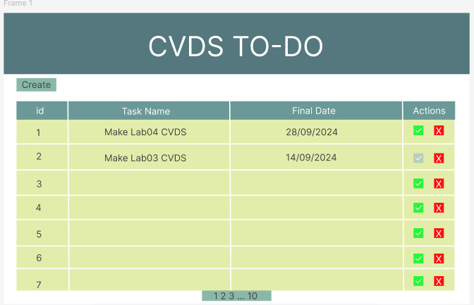
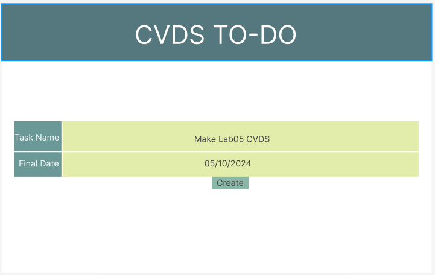

# Laboratory 4 - CVDS

## Miembros:
- **Diego Cardenas**
- **Sebastian Cardona**
- **Zayra Gutierrez**
- **Andres Serrato**

# Nombre del proyecto
- **TO-DO-CVDS**

Este repositorio contiene una aplicación web sencilla de lista de tareas desarrollada con HTML, CSS y JavaScript. Los usuarios pueden crear, visualizar y navegar por una lista de tareas. 

# 1. MockUp del proyecto

Se realizó un mockup del proyecto en la herramienta Figma, donde se planteó la interfaz gráfica de la aplicación. En el mockup se pueden observar las diferentes pantallas de la aplicación, así como las funcionalidades que se implementarán en cada una de ellas.
Hay que tener en cuenta que el diseño final puede variar en función de las necesidades del proyecto.

https://www.figma.com/design/kkFWpGQRaCsQIJFRXwe13S/Untitled?node-id=0-1&t=pg2DZCoD0XhF4Tjb-1 

# 2. Funcionalidades

- **Creación de tareas: Los usuarios pueden agregar nuevas tareas con un nombre y una descripción a través de un formulario.**
- **Listado de tareas: Todas las tareas creadas se muestran en formato de tabla con soporte para paginación.**
- **Acciones: Espacio reservado para futuras funcionalidades de gestión de tareas (como marcar como completada y eliminar).**

# 3. Estructura del proyecto

├── index.html         

Estructura principal del HTML

├── styles.css         

Estilos para la aplicación

└── script.js          

JavaScript para manejar la gestión dinámica de tareas

# 4. Descripción de los archivos

## index.html
El contenedor principal tiene dos vistas:

- Vista de creación: Un formulario para crear nuevas tareas, al hacer clic en el botón "Crear".
- Tabla: En la vista principal, una tabla lista todas las tareas, incluyendo estado de la tarea, nombre de la tarea, descripción y acciones.

## styles.css

- Diseño responsive: Asegura que la aplicación web se adapte a diferentes tamaños de pantalla.
- Estilos básicos: Proporciona un aspecto limpio y sencillo para la tabla, botones y formularios.

## script.js
Este archivo manejará el comportamiento dinámico de la aplicación web:

- Creación de tareas: Captura los datos introducidos por el usuario en el formulario de creación de tareas y actualiza la lista de tareas dinámicamente.
- Eliminación de tareas: Elimina una tarea de la lista al hacer clic en el botón "Eliminar".
- Marcar como completada: Cambia el estado de una tarea a "completada" al hacer clic en el botón "Completar".
- Marcar como incompleta: Cambia el estado de una tarea a "incompleta" al hacer clic en el botón "Incompleta".

