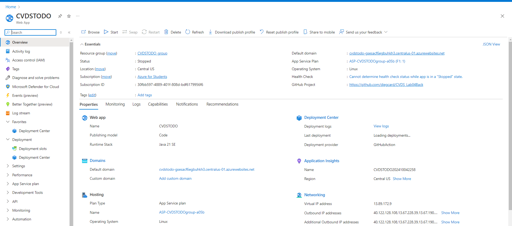

# Laboratory 4 - CVDS

## Miembros:
- **Diego Cardenas**
- **Sebastian Cardona**
- **Zayra Gutierrez**
- **Andres Serrato**

# Nombre del proyecto
- **TO-DO-CVDS**

Este repositorio contiene una aplicación web sencilla de lista de tareas desarrollada con HTML, CSS y JavaScript. Los usuarios pueden crear, visualizar y navegar por una lista de tareas.

# 1. MockUp del proyecto

Se realizó un mockup del proyecto en la herramienta Figma, donde se planteó la interfaz gráfica de la aplicación. En el mockup se pueden observar las diferentes pantallas de la aplicación, así como las funcionalidades que se implementarán en cada una de ellas.

https://www.figma.com/design/kkFWpGQRaCsQIJFRXwe13S/Untitled?node-id=0-1&t=pg2DZCoD0XhF4Tjb-1

# 2. Funcionalidades

- **Creación de tareas: Los usuarios pueden agregar nuevas tareas con un nombre y una descripción a través de un formulario.**
- **Listado de tareas: Todas las tareas creadas se muestran en formato de tabla con soporte para paginación.**
- **Paginación: Botones de navegación permiten al usuario moverse entre varias páginas de tareas.**
- **Acciones: Espacio reservado para futuras funcionalidades de gestión de tareas (como marcar como completada y eliminar).**

# 3. Estructura del proyecto

├── index.html

Estructura principal del HTML

├── styles.css

Estilos para la aplicación

└── script.js

JavaScript para manejar la gestión dinámica de tareas

# 4. Descripción de los archivos

## index.html
El contenedor principal tiene dos vistas:

- Vista principal: Muestra la lista de tareas con opciones para navegar entre páginas.
- Vista de creación: Un formulario para crear nuevas tareas, al hacer clic en el botón "Crear".
- Tabla: En la vista principal, una tabla lista todas las tareas, incluyendo ID de la tarea, nombre de la tarea, descripción y acciones.

Paginación: Incluye botones "Anterior" y "Siguiente" para navegar entre las páginas de tareas. Un indicador muestra el número de página actual y la cantidad total de páginas.

## styles.css

- Diseño responsive: Asegura que la aplicación web se adapte a diferentes tamaños de pantalla.
- Estilos básicos: Proporciona un aspecto limpio y sencillo para la tabla, botones y formularios.

## script.js
Este archivo manejará el comportamiento dinámico de la aplicación web:

- Creación de tareas: Captura los datos introducidos por el usuario en el formulario de creación de tareas y actualiza la lista de tareas dinámicamente.
- Paginación: Proporciona la funcionalidad básica para cambiar entre las diferentes páginas de tareas.

# Laboratorio 5 - CVDS

Cambios y nuevas modificaciones en el proyecto TO-DO-CVDS:

## Estructura del proyecto

Se han realizado las siguientes adiciones al proyecto con el fin de mejorar su funcionalidad:

Dificultad: Se ha añadido un campo para clasificar cada tarea según su nivel de dificultad, permitiendo una mejor organización en función de la complejidad.

Prioridad: Se ha implementado un campo de prioridad, que facilita la jerarquización de las tareas en función de su importancia.

Fecha Inicial: Este campo permitirá registrar la fecha de inicio de cada tarea, brindando un mejor seguimiento y control temporal.

Fecha Estimada: Se ha agregado un campo donde los usuarios podrán ingresar una fecha estimada de finalización, ayudando a prever tiempos y a planificar las tareas de manera más eficiente.

### Pestaña del boton de "Crear Tarea"

### Página de análisis de la tarea

#### Histograma de dificultad

#### Gráfica de Numero de tareas completadas a lo largo del tiempo.

#### Gráfica de tiempo estimado promedio por prioridad de tarea.

#### Gráfica de tiempo total dedicado a las tareas completadas a lo largo del tiempo.

### Pestaña editar tarea

### Funcionalidad boton tarea realizada o tarea no realizada.

