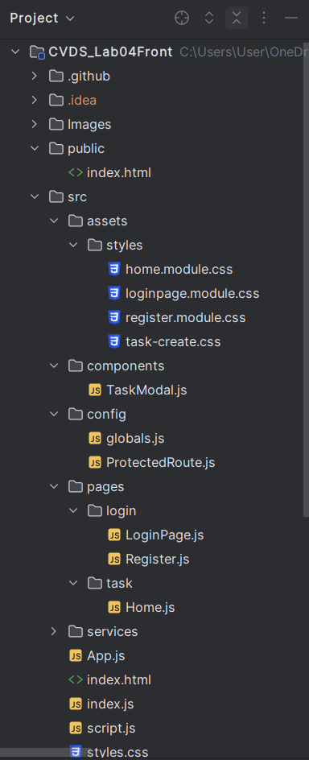
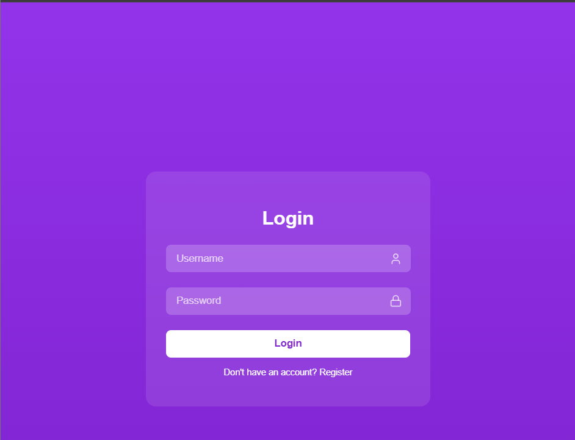
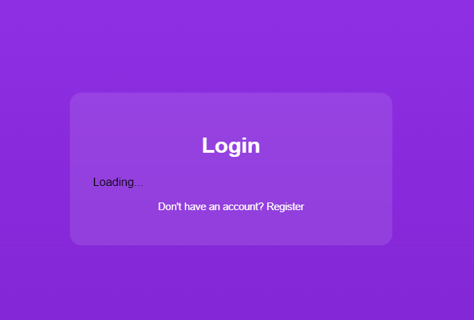
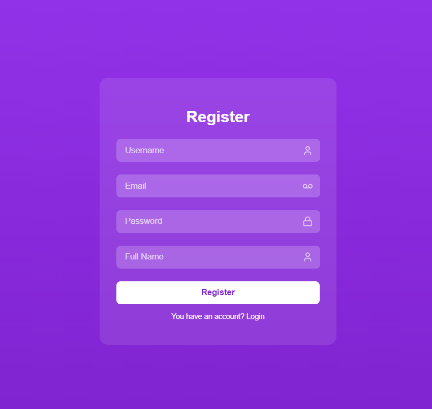
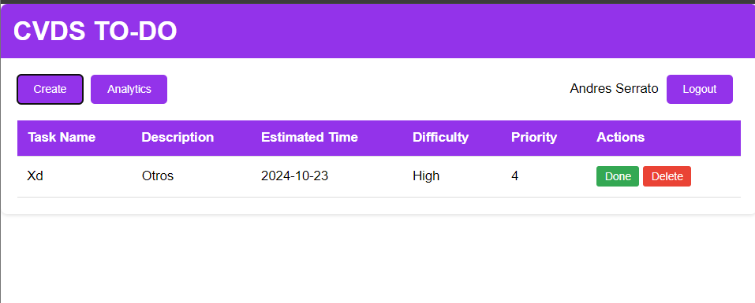
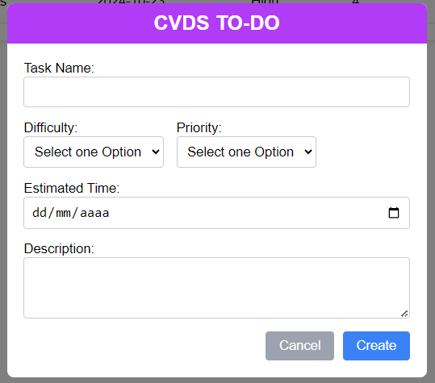

# Laboratory 4 - CVDS

## Miembros:
- **Diego Cardenas**
- **Sebastian Cardona**
- **Zayra Gutierrez**
- **Andres Serrato**

# Nombre del proyecto
- **TO-DO-CVDS**

La aplicación web de Gestión de Tareas permite a los usuarios organizar y administrar sus tareas de forma eficiente. Desarrollada con una arquitectura moderna y principios de diseño SOLID, asegura un código sólido, fácil de mantener y escalable. La plataforma cuenta con dos módulos principales: Usuarios y Tareas, donde los usuarios pueden crear una cuenta, acceder al sistema y gestionar sus listas de tareas pendientes.

El backend se ha implementado con Spring Boot y el proyecto se gestiona mediante Maven para facilitar su configuración y administración. 

El frontend está desarrollado con React, proporcionando una interfaz de usuario interactiva y fácil de usar.

### Características Principales: 

1. Gestión de Usuarios:

 Registro y autenticación de usuarios.

Inicio de sesión con validación de credenciales.

Crear, editar, eliminar y ver tareas. 

Asignación de prioridades y fechas inicio y fin . 

Visualización de tareas pendientes y completadas. 

### Tecnologías y Herramientas Utilizadas: 

Frontend:

React: Framework para el desarrollo de la interfaz de usuario, permitiendo una experiencia dinámica e interactiva. 

Integración Continua / Despliegue Continuo (CI/CD):

Azure DevOps: Plataforma usada para la planeación y gestión del proyecto, por medio de la metodología Scrum.

Tests automatizados: Implementación de pruebas unitarias y de integración, garantizando la calidad del código.

Infraestructura y Despliegue:

Azure Web App: Plataforma en la nube donde la aplicación es desplegada y alojada. 

Sección de Usuarios:

Creación de tareas con descripciones, fechas y prioridades. Posibilidad de marcar tareas como completadas o pendientes. Visualización clara de las tareas en una lista ordenada por prioridad o fecha de vencimiento. 
Flujo de Trabajo: Registro e Inicio de Sesión: Los usuarios se registran proporcionando un nombre de usuario y contraseña. 
Una vez autenticados, pueden acceder a su perfil y gestionar sus tareas.

Gestión de Tareas: Los usuarios pueden crear nuevas tareas, asignarles una prioridad y actualizarlas según sea necesario. Además, las tareas se pueden marcar como completadas o eliminadas.

# 1. MockUp del proyecto

Se realizó un mockup del proyecto en la herramienta Figma, donde se planteó la interfaz gráfica de la aplicación. En el mockup se pueden observar las diferentes pantallas de la aplicación, así como las funcionalidades que se implementarán en cada una de ellas.
Hay que tener en cuenta que el diseño final puede variar en función de las necesidades del proyecto.

https://www.figma.com/design/kkFWpGQRaCsQIJFRXwe13S/Untitled?node-id=0-1&t=pg2DZCoD0XhF4Tjb-1 

# 2. Funcionalidades

- **Creación de tareas: Los usuarios pueden agregar nuevas tareas con un nombre y una descripción a través de un formulario.**
- **Listado de tareas: Todas las tareas creadas se muestran en formato de tabla con soporte para paginación.**
- **Edición de tareas: Los usuarios pueden editar el nombre y la descripción de una tarea existente.**
- **Eliminación de tareas: Los usuarios pueden eliminar una tarea de la lista.**
- **Marcar como completada: Los usuarios pueden marcar una tarea como completada.**
- **Marcar como incompleta: Los usuarios pueden marcar una tarea como incompleta.**
- 

# 3. Estructura del proyecto

# 4. Desarrollo

## 4.1. Login

Al iniciar sesión se realizan validaciones de las credenciales

## 4.2. Registro

## 4.3. Pantalla principal

## 4.4. Creación de tareas

